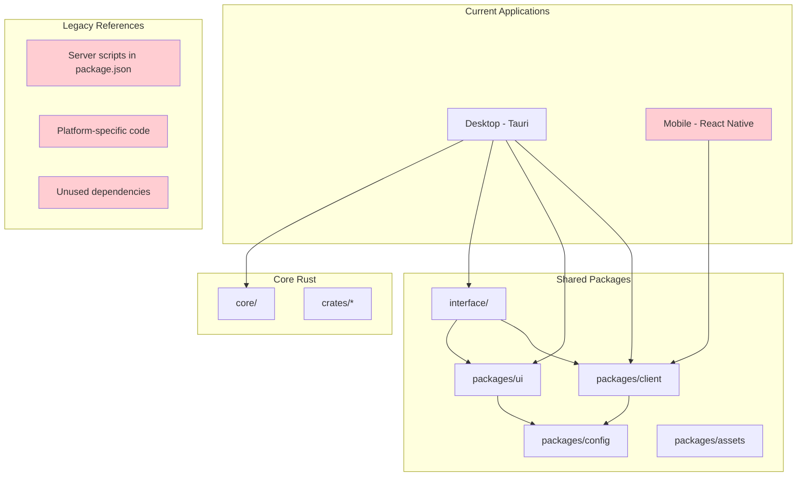
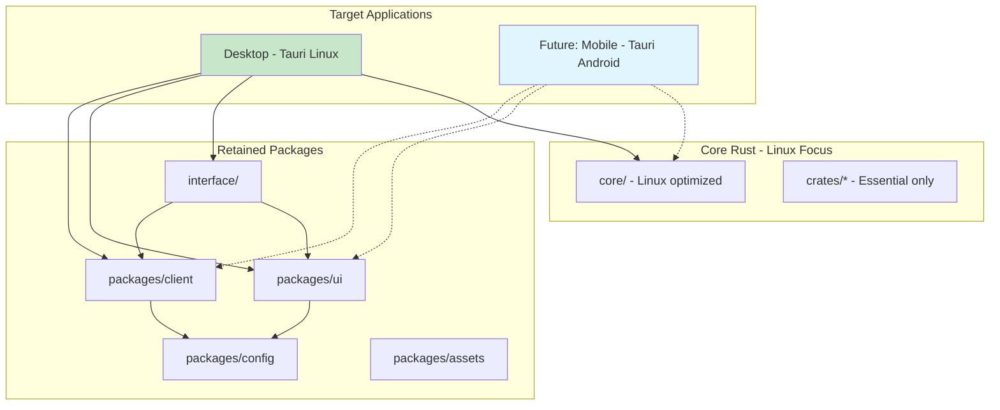

# Design Document - Scope Reduction to Linux and Android

## Overview

This design outlines the systematic approach to completing Overdrive's scope reduction from a multi-platform application to a focused Linux desktop and Android mobile solution. Several applications have already been removed (storybook, landing, web), and this phase will complete the remaining cleanup tasks. The design prioritizes safety, maintains functionality, and ensures a clean, maintainable codebase.

## Architecture

### Current State Analysis



### Target State Architecture



## Components and Interfaces

### 1. Remaining Cleanup Strategy

#### Priority Order
1. **Mobile App** (highest risk - React Native dependencies and complex setup)
2. **Server References** (medium risk - cleanup package.json scripts)
3. **Platform-Specific Code** (medium risk - conditional compilation cleanup)
4. **Unused Dependencies** (low risk - dependency tree optimization)

#### Dependency Validation Process
```rust
// Validation approach for remaining removals
struct CleanupValidator {
    desktop_app: App,
    shared_packages: Vec<Package>,
}

impl CleanupValidator {
    fn validate_mobile_removal(&self) -> Result<(), CleanupError> {
        // Ensure desktop app doesn't depend on mobile-specific code
        if self.desktop_app.has_mobile_dependencies() {
            return Err(CleanupError::HasCriticalDependencies);
        }

        // Check shared packages still work without mobile
        for package in &self.shared_packages {
            if !package.works_without_mobile() {
                return Err(CleanupError::BreaksSharedPackage);
            }
        }

        Ok(())
    }
}
```

### 2. Platform-Specific Code Removal

#### Conditional Compilation Cleanup
```rust
// Before: Multiple platform support
#[cfg(target_os = "windows")]
use crate::volume::windows::WindowsVolume;
#[cfg(target_os = "macos")]
use crate::volume::macos::MacOsVolume;
#[cfg(target_os = "linux")]
use crate::volume::linux::LinuxVolume;

// After: Linux-focused with Android preparation
use crate::volume::linux::LinuxVolume;

#[cfg(target_os = "android")]
use crate::volume::android::AndroidVolume;
```

#### File System Module Restructure
```rust
// core/src/volume/mod.rs - Before
pub mod linux;
#[cfg(target_os = "macos")]
pub mod macos;
#[cfg(target_os = "windows")]
pub mod windows;

// core/src/volume/mod.rs - After
pub mod linux;
#[cfg(target_os = "android")]
pub mod android;

pub use linux::LinuxVolume as Volume;
#[cfg(target_os = "android")]
pub use android::AndroidVolume as Volume;
```

### 3. Dependency Management

#### Cargo Workspace Cleanup
```toml
# Cargo.toml - Current state needs cleanup
[workspace]
members = [
    "apps/desktop/crates/*",
    "apps/desktop/src-tauri",
    "apps/mobile/modules/sd-core/android/crate",  # Remove
    "apps/mobile/modules/sd-core/core",           # Remove
    "apps/mobile/modules/sd-core/ios/crate",      # Remove
    "core",
    "core/crates/*",
    "crates/*"
]

# Cargo.toml - Target state
[workspace]
members = [
    "apps/desktop/crates/*",
    "apps/desktop/src-tauri",
    "core",
    "core/crates/*",
    "crates/*"
]
```

#### Platform Dependencies Removal
```toml
# Remove Windows dependencies
[target.'cfg(windows)'.workspace.dependencies]
windows = { version = "0.58", features = [...] }  # DELETE

# Remove macOS dependencies
[target.'cfg(target_os = "macos")'.dependencies]
cocoa = "0.25"     # DELETE
objc = "0.2"       # DELETE

# Remove iOS dependencies
[target.'cfg(target_os = "ios")'.workspace.dependencies]
swift-rs = "1.0.7"  # DELETE

# Keep Android dependencies for future
[target.'cfg(target_os = "android")'.workspace.dependencies]
jni = "0.21"  # KEEP
```

### 4. Build System Optimization

#### Package.json Cleanup
```json
{
  "scripts": {
    // Remove remaining unused scripts
    "mobile": "pnpm --filter @sd/mobile --",      // DELETE
    "core": "pnpm --filter @sd/server -- ",       // DELETE (server reference)

    // Keep essential scripts
    "desktop": "pnpm --filter @sd/desktop --",
    "tauri": "pnpm desktop tauri",
    "dev:desktop": "pnpm run --filter @sd/desktop tauri dev",
    "bootstrap:desktop": "cargo clean && ./scripts/setup.sh && pnpm i && pnpm prep && pnpm tauri dev"
  }
}
```

#### Tauri Configuration Update
```json
{
  "bundle": {
    "targets": [
      "appimage",    // Keep - Linux
      "deb"          // Keep - Linux
      // Remove: "dmg", "msi", "nsis"
    ]
  },
  "plugins": {
    // Remove platform-specific plugins
  }
}
```

## Data Models

### Cleanup Tracking
```typescript
interface CleanupPlan {
  remainingApps: {
    name: string;
    path: string;
    dependencies: string[];
    riskLevel: 'low' | 'medium' | 'high';
  }[];

  platformCode: {
    files: string[];
    conditionalBlocks: string[];
    dependencies: string[];
  };

  scriptCleanup: {
    packageJsonScripts: string[];
    workspaceReferences: string[];
  };
}
```

### Validation Results
```typescript
interface ValidationResult {
  buildSuccess: boolean;
  testsPassing: boolean;
  performanceMetrics: {
    buildTime: number;
    binarySize: number;
    dependencyCount: number;
  };
  regressions: string[];
}
```

## Error Handling

### Cleanup Safety Checks
1. **Pre-cleanup Validation**:
   - Verify desktop app builds successfully
   - Create backup of current state
   - Run full test suite

2. **During Cleanup**:
   - Incremental removal with validation
   - Immediate rollback on critical errors
   - Continuous build verification

3. **Post-cleanup Validation**:
   - Full build verification
   - Functionality testing
   - Performance benchmarking

### Error Recovery Strategy
```bash
#!/bin/bash
# Rollback script for failed cleanup
rollback_cleanup() {
    local backup_branch="$1"
    echo "Rolling back to $backup_branch"
    git checkout "$backup_branch"
    pnpm install
    cargo build
    echo "Rollback complete"
}
```

## Testing Strategy

### Automated Testing Pipeline
```yaml
# .github/workflows/scope-reduction.yml
name: Scope Reduction Validation
on: [push, pull_request]

jobs:
  validate-cleanup:
    runs-on: ubuntu-latest
    steps:
      - name: Checkout
        uses: actions/checkout@v3

      - name: Setup Environment
        run: ./scripts/setup-overdrive.sh

      - name: Build Desktop App
        run: pnpm desktop tauri build

      - name: Run Tests
        run: |
          cargo test
          pnpm typecheck

      - name: Performance Benchmark
        run: ./scripts/measure-metrics.sh

      - name: Validate Functionality
        run: ./scripts/validate-environment.sh
```

### Manual Testing Checklist
- [ ] Desktop app builds successfully
- [ ] Desktop app launches without errors
- [ ] File operations work correctly
- [ ] Settings and preferences preserved
- [ ] Database migrations work
- [ ] Performance meets benchmarks

## Performance Considerations

### Expected Improvements
1. **Build Time**: 30-50% reduction
   - Fewer Rust crates to compile
   - Fewer Node.js packages to process
   - Simplified dependency resolution

2. **Binary Size**: 20-40% reduction
   - Removed platform-specific code
   - Fewer bundled dependencies
   - Optimized for single platform

3. **Development Experience**:
   - Faster hot reloads
   - Simpler debugging
   - Reduced context switching

### Benchmarking Strategy
```rust
// Performance benchmarking
#[cfg(test)]
mod benchmarks {
    use criterion::{black_box, criterion_group, criterion_main, Criterion};

    fn bench_file_operations(c: &mut Criterion) {
        c.bench_function("file_scan", |b| {
            b.iter(|| {
                // Benchmark file scanning performance
                black_box(scan_directory("/tmp/test"))
            })
        });
    }

    criterion_group!(benches, bench_file_operations);
    criterion_main!(benches);
}
```

## Security Considerations

### Safe Cleanup Process
1. **Data Preservation**: Ensure no user data is lost
2. **Configuration Migration**: Preserve user settings
3. **Backup Strategy**: Create recovery points
4. **Validation**: Comprehensive testing before finalization

### Linux-Specific Security
1. **File Permissions**: Proper handling of Linux file permissions
2. **Sandboxing**: Maintain Tauri security model
3. **System Integration**: Safe interaction with Linux desktop

This design provides a comprehensive, safe approach to completing Overdrive's scope reduction while maintaining all essential functionality and improving performance and maintainability.
